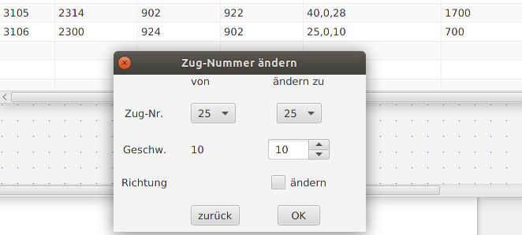

# Fahrten
Fahrten (Zugfahrten) sind die Kombination aus einer Fahrstraße und einer Lok (mit Richtung und Geschwindigkeit) – durch 

Sie können in der "Fahrten-Tabelle" editiert werden. Die Start-/Stop-Delays sind nicht in der Eingabemaske vorhanden und sind daher immer zunächst mit 1000 msec vorbelegt. Start-Delay heisst: xy Millisekunden nach Stellen der Fahrstraße fährt der Zug los - Stop-Delay heisst: x Millisekunden nach Erreichen des Stop-GBM hält der Zug an (V=0, anhalten also mit der programmierten Verzögerung im Dekoder). Den Stop-Delay kann man anpassen, um ein zentimetergenaues Anhalten des Zuges vor dem Signal zu erreichen.

Einen kompletten Zug ändern kann man in der Fahrten Tabelle mit „Zug ändern“ - dann öffnet sich eine Maske mit dem „alten“ Zug (incl Geschwindigkeit) auf der linken Seite und dem „neuen“ auf der rechten Seite. Hier kann man auch nur die Geschwindigkeit ändern – oder nur die Richtung (oder alles).

-> Weiter zu [Fahrpläne](11-Fahrplaene.md)

-> Zurück zum [Index](index.md)