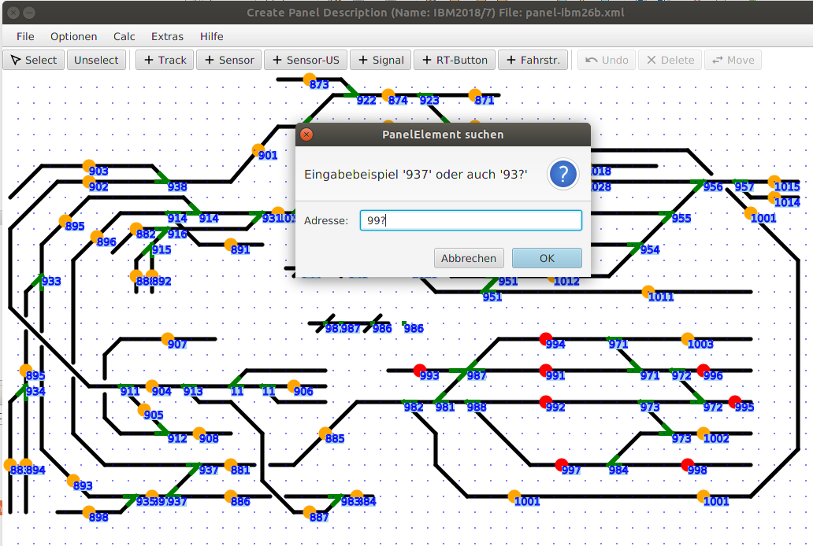

# Extras Menü

## Suche nach Adressen

Eine Suche nach Panel-Elementen mit einer bestimmten Adresse kann man aktivieren per „Extras→Suche nach Adressen“ Menü. Dabei kann entweder nach der exakten Adresse gesucht werden (z.B. 937 = Adr93, bit7) oder auch nach SX-Adresse allein, wenn man die letzte Ziffer durch ein Fragezeichen ersetzt („93?“ → alle Elemente, deren SX-Adresse gleich 97 ist).
Als Ergebnis der Suche werden die entsprechenden Paneel-Element rot markiert. 

-> weiter zu [Optionen Menü](6-Optionen.md)

-> zurück zum [Index](index.md)