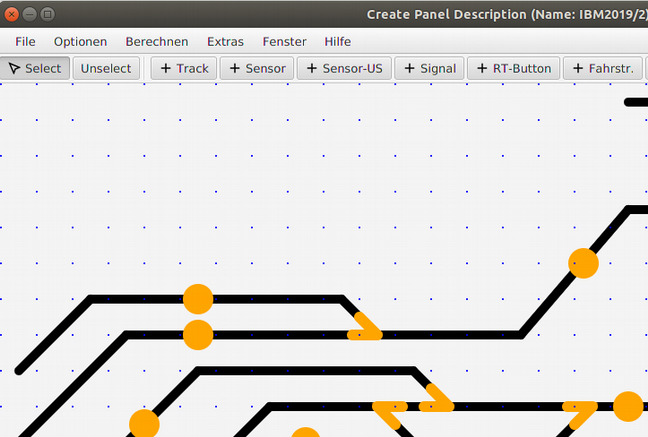

# Optionen Menü

## Eingabe eines „panelname“

Unter Optionen kann ein Panel-Name eingegeben werden, der mit im panel.xml File abgespeichert wird – und später dann im LanbahnPanel-Programm im Kopf angezeigt wird.

## Adressen anzeigen

Auf dem Gleisbild die Adressen aller Panel-Elemente anzeigen. Ein "+" hinter der Nummer bedeutet, dass eine weitere Adresse (also ein weiteres SX-Bit für mehrbegriffige Signal, oder eine 2. Adresse "adr+1000" bei Sensoren für die Fahrstraßenanzeige) existiert.

## Raster

Falls aktiviert: ein 20x20 Raster wird angezeigt und alle Elemente können nur in einem 10x10 Raster erzeugt und verschoben werden.

## Zoom In / Zoom Out

Die Ansicht auf dem Bildschirm kann im „Optionen“ Menü vergrößert und verkleinert werden – ohne dass wie bei „Scale“ die x- und y-Werte im XML File tatsächlich verändert werden – diese Funktion nennt sich Zoom In / Zoom Out.

Oben: normale Anzeige - Unten:  „zoom“ Anzeige.

-> Weiter zu [Berechnen Menü](7-Berechnen.md)

-> Zurück zum [Index](index.md)