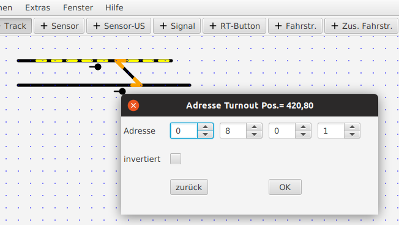

# SX-Adressen, virtuelle Adressen

Die Adressen von „Aktiven Elementen“ (Signale, Sensoren, Weichen) können eingegeben werden, nachdem man durch Click mit der rechten Maustaste ein entsprechendes Element ausgewählt hat. Es öffnet sich dann ein Popup Fenster, in dem eine Adresse eingegeben werden kann (SX 0.. 106, Bit 1..8 – oder auch virtuelle Adressen >= 1200).

Adressen werden als „lange Adressen“, die sowohl SX-Adresse wie SX-bit enthalten, gespeichert – aus 80-Bit1 wird dann adr=“801“ (siehe oben)1. 

Bei Weichen kann auch „invertiert“ ausgewählt werden, dann werden die Weichenstellungen gerade/ abzweigend vertauscht.

Bei Signalen kann man zusätzlich die Orientierung wählen (0 Grad, 45 Grade, 90 Grad, 135 Grad, …) - und wählen, ob auch die Folgeadresse zum Signal gehört. Dies ist notwendig, wenn auch Hp2 angezeigt werden soll (gelb, State =2) – d.h. wenn das Signal 2 SX-Bits belegt.

Nach dem Ändern von Weichen- und Signaladressen werden auch die entsprechenden Einträge in den Fahrstraßen-Tabellen automatische auf die neue Weichen/Signal-Adresse geändert.

-> weiter zu [File Menü](file_menu.md)

-> zurück zum [Index](index.md)