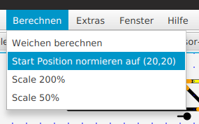

# File Menü

Ein Panel abspeichern oder einen Panel-File laden kann man über das File-Menü. 

## Einzelne Panel-Elemente löschen

Hierzu muss der „Select“ Button gedrückt sein – mit Maus Click kann man dann eines oder mehrere Elemente auswählen, sie werden dann ROT gezeichnet. 
Drücken auf den Button „DELETE“ löscht jeweils eines der selektierten (roten) Elemente (also mehrfach drücken, wenn man mehrere ausgewählt hat, die man löschen möchte.)

## Eingabe eines „panelname“

Unter Optionen kann ein Panel-Name eingegeben werden, der mit im panel.xml File abgespeichert wird – und später dann im LanbahnPanel-Programm im Kopf angezeigt wird.

## Verschieben von Panel-Elementen

Nach Auswahl von einem oder mehreren Panel-Elementen per „SELECT“ können sie nach Drücken des „MOVE“ Buttons per Mouse-Drag verschoben werden (im 10 x 10 Raster, wenn nicht über „Optionen→Raster“ das Raster deaktiviert worden ist).

## Bearbeiten von ganzen Panels

Der „Nullpunkt“ von Panels kann automatisch nach 20,20 verschoben werden – mit „Calc“→ „Norm Positions“, siehe

-> weiter zu [Optionen Menü](options_menu.md)

-> zurück zum [Index](index.md)