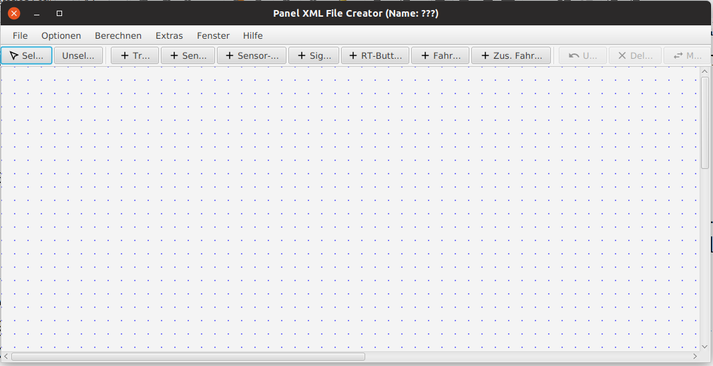

# Installation

1. Java 8 auf dem PC / Raspberry PI installieren
2. Download des Programms („SX4Draw.jar“)
3. Starten des Programms
   
SX4Draw wird gestartet mit

    java -jar SX4Draw.jar 

Es öffnet sich eine leere Zeichenfläche, auf der ein Gleisplan gezeichnet werden kann:

-> Weiter mit dem [Zeichnen von Gleisen, Sensoren und Signalen](draw_elements.md)

-> Zurück zum [Index](index.md)
