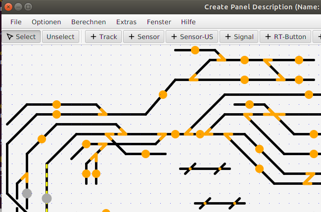
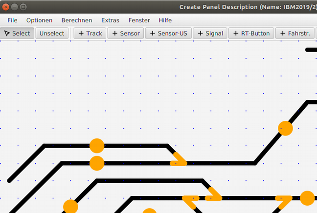

# Optionen Menü

## Zoom In / Zoom Out

Die Ansicht auf dem Bildschirm kann im „Optionen“ Menü vergrößert und verkleinert werden – ohne dass wie bei „Scale“ die x- und y-Werte im XML File tatsächlich verändert werden – diese Funktion nennt sich Zoom In / Zoom Out.

Oben: normale Anzeige - Unten:  „zoom“ Anzeige.

-> Zurück zum [Index](index.md)