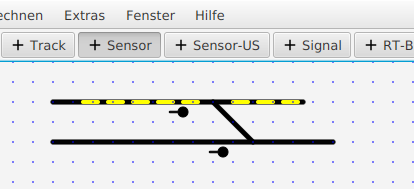

# SX4Draw - Zeichnen von Gleisen, Sensoren und Signalen

Mit den *"+" Buttons* :

kann jeweils ein „Panel-Element“ ausgewählt werden, also ein Gleis, Sensor (=GBM), Signal, eine Fahrstraße (Route) oder eine zusammengesetzte Fahrstraße (CompRoute), die man zum Gleisplan-XML (Panel) hinzufügen kann.

Man beginnt am Besten mit dem Zeichnen der Gleise – nach Auswahl von „+ Track“ können Gleise als Linien gezeichnet werden. Mit Maus-Click wird ein Track begonnen (StartPunkt), dann bei  gedrückter linker Maustaste an einen Endpunkt gezogen und Loslassen beendet das Gleis (den Track). Die Lage der Gleise wird hierbei auf  0 Grad, 45 Grad und 90 Grad eingeschränkt. Alle Gleise und Signale, Weichen, Fahrstraßentasten etc liegen auf einem 10x10 Raster (welches man aber auch deaktivieren kann) und werden als Vektor Graphiken gezeichnet, nicht als Bitmaps.

Auf die Gleise können dann zB Sensoren (auch Gleisbesetztmelder, Gleisbelegtmelder oder Gleisfreimelder genannt) gemalt werden, wenn vorher der „+ Sensor“ Button gedrückt wurde  (oder der „+ Sensor-US“ Button – dieser wird als „US-Lampe“ im LanbahnPanel angezeigt). 

Ebenso können Signale hinzugefügt werden, es entsteht dann z.B.:

Fahrstraßentasten (RT-Buttons)  werden benötigt, wenn man Fahrstraßen verwenden will – jeweils eine am Beginn und eine am Ende einer Fahrstraße.

-> Weiter zu [Weichen](03-Weichen.md)

-> Zurück zum [Index](index.md)