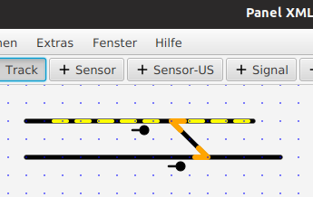

# SX4Draw - Weichen

Weichen müssen nicht als eigene Elemente eingegeben werden, sondern werden vom Programm berechnet („Berechnen → Weichen berechnen“) , wenn ein Gleis auf ein anderes trifft.
Das Ergebnis ist in diesem Fall:

Die erkannten Weichen werden in Orange markiert (diese Weichenerkennung kann man auch mehrfach laufen lassen, wenn man weitere Gleise hinzugefügt hat – die Daten der bereits vorher erstellten Weichen bleiben erhalten.)

Doppelte Kreuzungsweichen und Kreuzungen werden dadurch unterschieden, dass die ersteren (=DKW) nur berechnet werden, wenn eines der beiden kreuzenden Gleise nicht durchgehend ist, sondern exakt am Kreuzungspunkt beendet und neu angefangen wird.

-> weiter zu [SX-Adressen, virtuelle Adressen](04-Adressen.md)

-> zurück zum [Index](index.md)