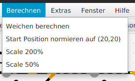

# SX4Draw - Berechnen Menü

## Weichen berechnen

siehe [Weichen](03-Weichen.md)

## Start Position normieren

Der „Nullpunkt“ des Panels (kleinster x-Wert, kleinster y-Wert aller Panel-Elemente)kann automatisch nach 20,20 verschoben werden – mit „Calc“→ „Norm Positions“, siehe

## Scale 200%, Scale 50%

Die x/y-Werte aller Panel-Elemente werden auf das Doppelte vergrößert bzw halbiert. So kann man ein Panel "auseinanderziehen", wenn man merkt das die Elemente zu nah beeinanderliegen.

(Im Gegensatz dazu bezieht sich "Zoom-In/Zoom-Out" nur auf die aktuelle Anzeige - die x/y-Werte werden dabei NICHT verändert.)

-> Weiter zu [Fahrstraßen](08-Fahrstrassen.md)

-> Zurück zum [Index](index.md)