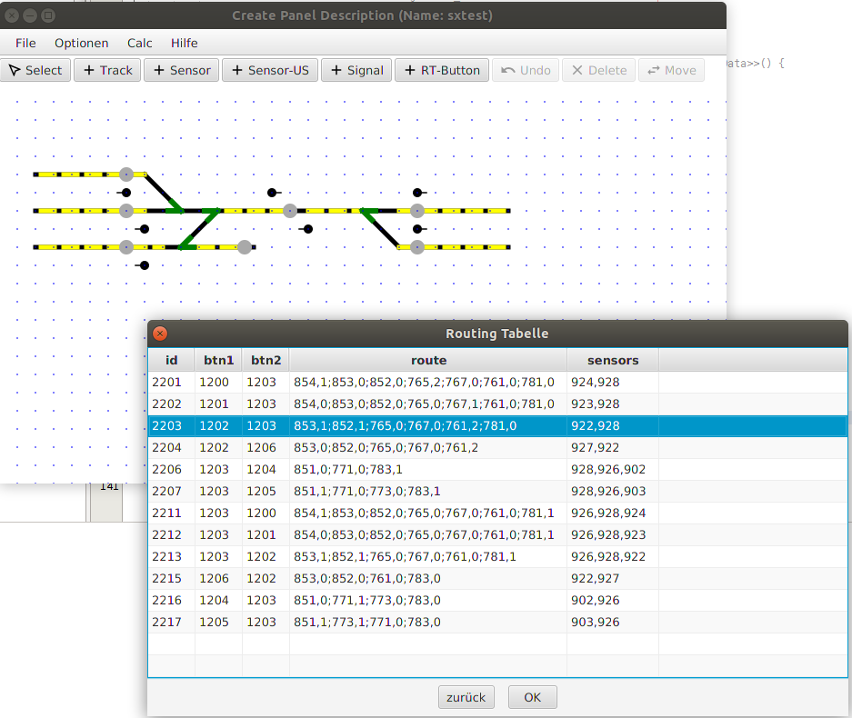

# SX4Draw - Fahrstraßen (Routing)

Mit „RouteButtons“ im Gleisbildstellwerk kann eine Fahrstraße eingestellt werden – von einem Start-Button (btn1) zu einem End-Button (btn2). Jede Fahrstraße muss einen Start-Sensor (Gleisbesetztmelder) und einen Stop-Sensor (GBM) haben, denn mit Hilfe des Stop-GBM wird bei Fahrplanbetrieb die Fahrstraße beendet (=aufgelöst, wenn denn Stop-GBM von einem Zug belegt wird). 

Unter dem Menü „Fenster“ → „Routing Tabelle“ können alle Routen numerisch angezeigt und die Werte für die Fahrstraße und die Sensoren editiert werden (nicht editiert werden können: Adr(ID), Start- und Ende-Button):

Die Definition der Signalstellung kann (nur direkt beim Erstellen) durch mehrfaches Klicken auf das Signal erfolgen. Wenn das Signal 2 Adressen hat, so sind 4 Stellungen möglich (sonst nur 2): 

Rot=0 oder Grün=1 oder Gelb=2 oder pink=3 („pink“ kann zum Beispiel auf der Anlage 1) Anzeige der „feather“ (nur UK) bedeuten oder 2) Rangierfahrt frei), es andere Farben, 4 mögliche, wenn das Signal 2 Adressen hat - sonst nur rot/grün)

-> weiter zu [Fahrstraßen erstellen](09-Fahrstrassen_erstellen.md)

-> zurück zum [Index](index.md)