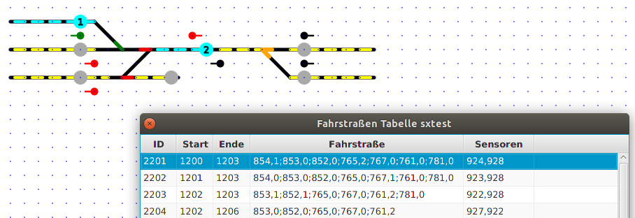

# SX4Draw - Fahrstraßen graphisch erstellen

Nach Eingabe von Adressen für Sensoren, Weichen und Signale können Fahrstraßen graphisch erstellt werden, in dieser Reihenfolge:

1. Start Button clicken (also auf den Route-Button, bei dem die Fahrstraße starten soll)
2. dann auf alle Elemente klicken, die zu der Fahrstraße gehören sollen, also auf Sensoren, Weichen, Signale (bei den Weichen kann dabei auch der Zustand gewählt werden, indem man auf das Ende des abzweigenden bzw. durchgehenden Track der Weiche klickt (=grün)
3. Ende Button klicken, dann wird die Fahrstraße gespeichert. 

Im Fahrstraßen-Editor ("Routing"-Tabelle) können Weichen- und Signalstellungen korrigiert werden.

Während des Erstellens werden die gewählten Elemente in Türkis markiert:

Nach klick auf den „Ende Button“ sieht das im Fahrstraßen-Editor so aus:

Mit „rechter Maustaste“ auf eine Zeile im Fahrstraßen-Editor kann man 
a) Fahrstraßen löschen und 
b) Fahrstraßen „debuggen“, man kann sich eine Fahrstraße anzeigen lassen, hierbei werden alle Elemente markiert, die Weichen- und Signalstellungen angezeigt und der Start-Btn mit „1“ und der End-Button mit „2“ markiert:

Wenn eine andere Fahrstraße gewählt wird, so wird die aktuell markiert wieder „ent-markiert“.

## Welche Fahrstraßen sind schon eingegeben?

Ein Klick auf die rechte Maustaste bei Fahrstraßen-Tastern (RouteButtons) bewirkt, dass angezeigt wird, welche Fahrstraßen von dieser Taste ausgehen. Die Start-Taste wird mit „1“ markiert, die möglichen Fahrstraßen-Ende-Taster mit „2“, ein Beispiel:

## Zusammengesetzte Fahrstraßen

Damit die Erstellung von Fahrstraßen „schneller von der Hand geht“, kann man je 2 Fahrstraßen auch zusammenfassen zu einer „Zusammengesetzten Fahrstraße“ (CompRoute).

Hierzu wählt man im graphischen Editor „+ Zus. Fahrstraße“ aus und klickt auf den „Anfangs-Fahrstrassen Button“ der Fahrstraße 1, dann auf den „End-Button“ der Fahrstraße 2 – dann wird eine neue Zusammengesetzte Fahrstraße aus „Fahrstraße 1 plus Fahrstraße 2“ generiert. Diese kann ebenfalls „debugged“ werden.

Zusammengesetzte Fahrstraßen, die aus mehr als 2 Einzelfahrstraßen bestehen, sind NICHT möglich.

-> weiter zu [Fahrten (Trips)](10-Fahrten.md)

-> zurück zum [Index](index.md)