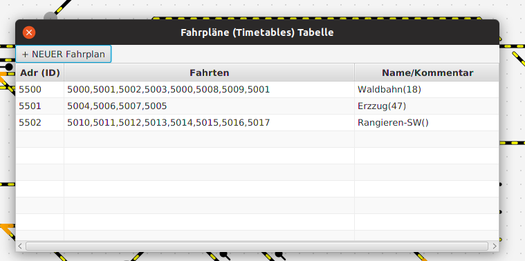
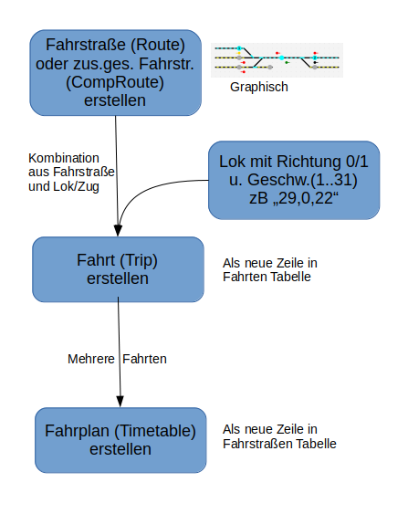

# SX4Draw - Fahrpläne

Fahrpläne sind eine Abfolge von Fahrten, ein "Name" dient zur leichteren Identifizierung.

Sie können im SX4 Programm einen Fahrplan (der im panel.xml File enthalten sein muss) starten – dann 
werden die Fahrten in der gespeicherten  Reihenfolge ausgeführt – vorausgesetzt, auf den Start-Sensoren 
der jeweiligen Fahrstraße steht jeweils ein Zug (sonst weiß das Programm nicht, welche Lok es beschleunigen
 oder abbremsen soll).

Hier eine Übersicht zur Entstehung eines **Fahrplans**:

1. zunächst müssen die **Fahrstraßen** erstellt werden

2. kombiniert mit einer Lok(Zug)-Info(Adresse, Richtung und Geschwindigkeit) entsteht eine **Fahrt**

3. eine Liste von Fahrten ergibt dann einen **Fahrplan** - natürlich müssen die Fahrten so kombiniert werden, 
dass bei jeder Fahrt die **richtige** Lok auf dem Anfangssensor der Fahrt steht!

-> Weiter zu [Select](12-Select.md)

-> Zurück zum [Index](index.md)
